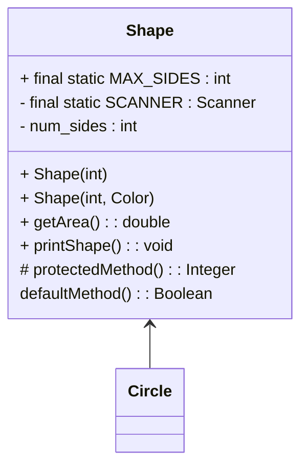

# Discussion and Live Session Relating to Module 02 and the Start of Module 03

## Q - Review UML
> Can you review UML diagrams in a more systematic way? Shall we include constructors there too?

Starting HW03 - 2 UML diagrams - always
* First: Is your plan
* Second: Is what you actually

* NOUNS - what are they - help define classes
* VERBS - for each now - these are my methods in the classes

## Q - Review Method Overloading
> Review method overloading. 

## Q - Make sure to define over writing 
> Why overwrite, when, etc.
